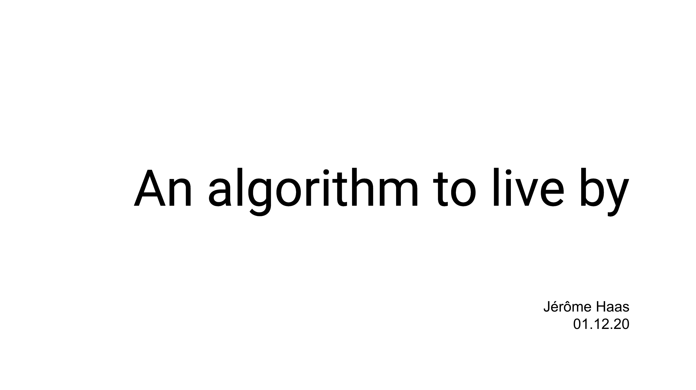
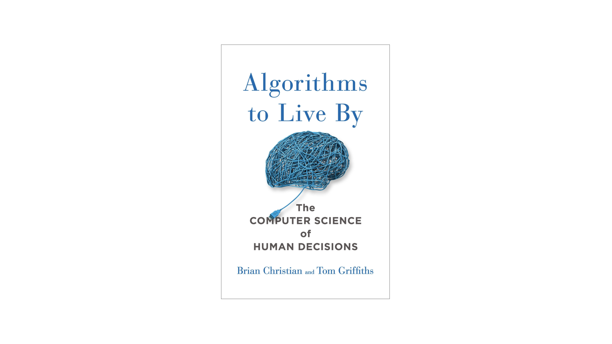
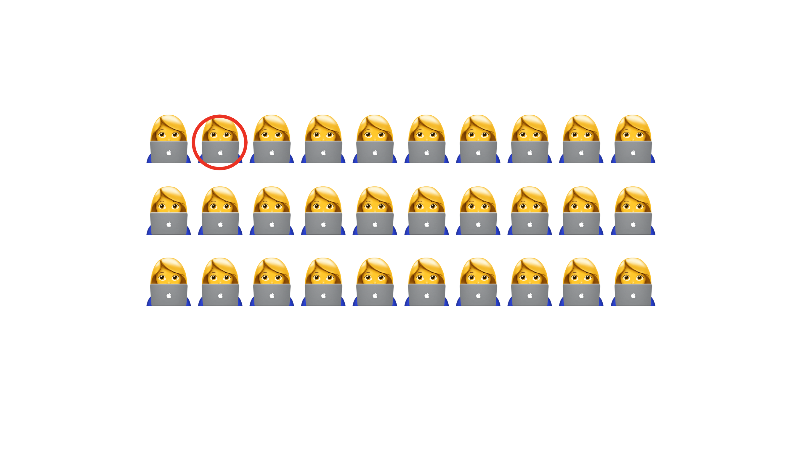
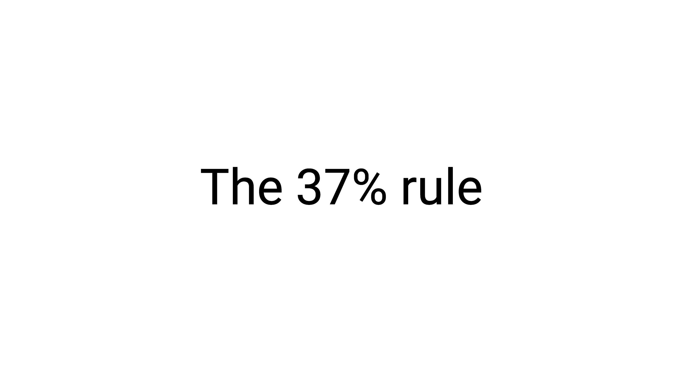
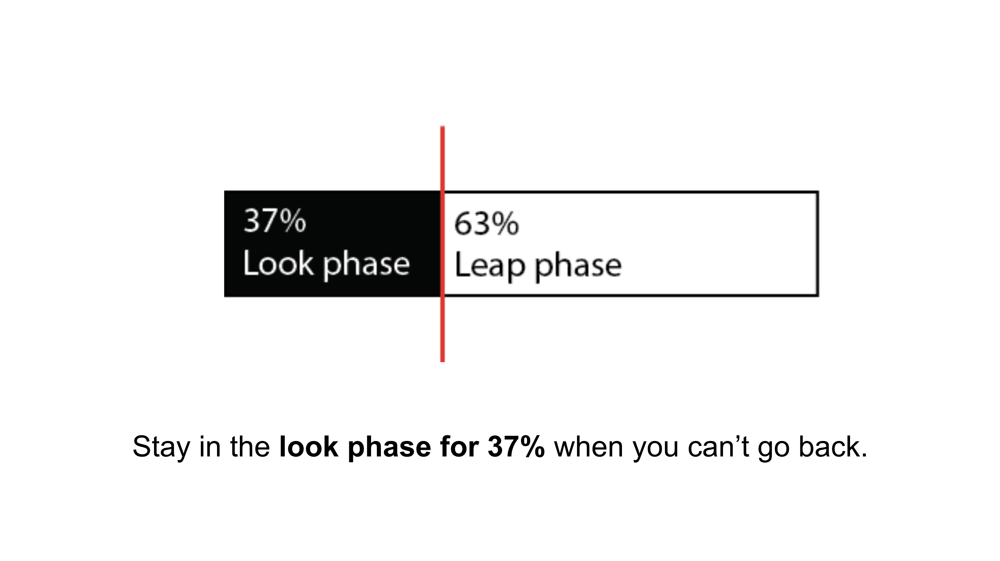
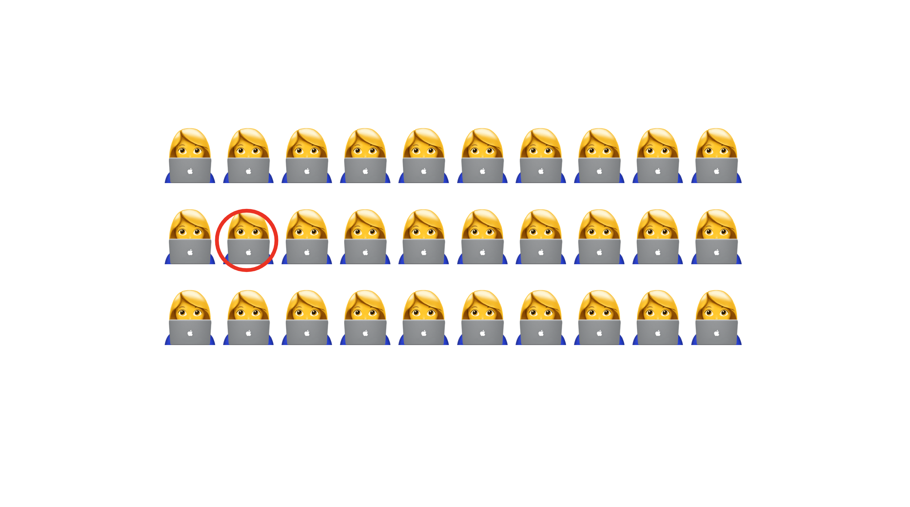
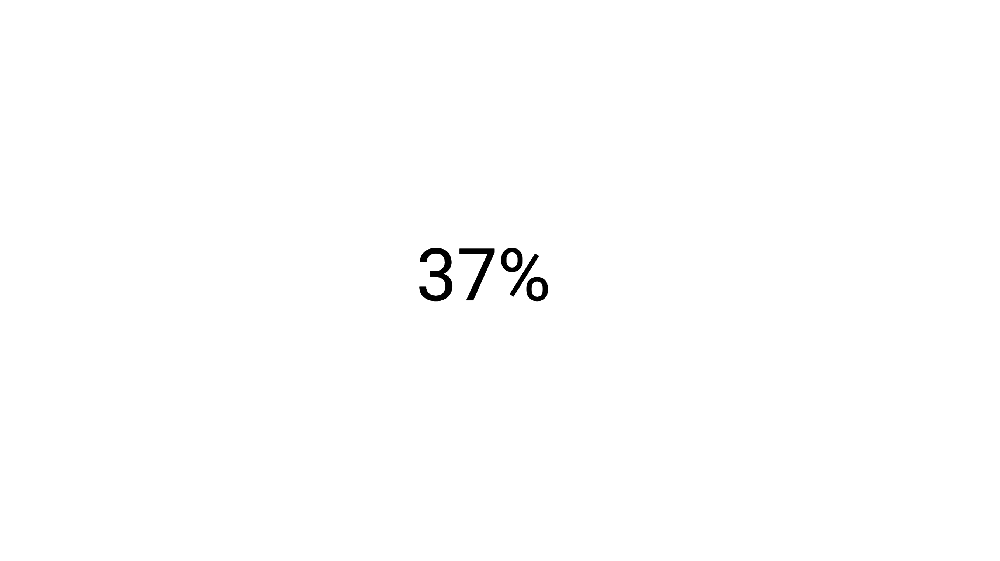
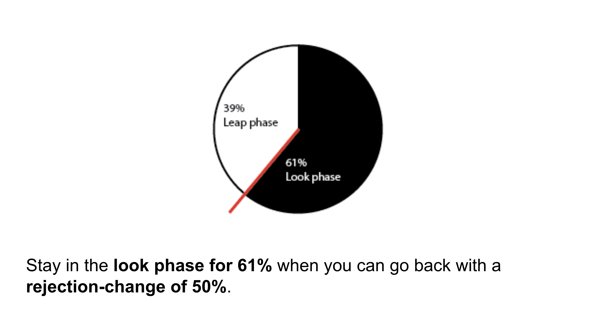

# An algorithm to live by

Hello.

Im my presentation I would like to talk about an algorithm to live by.

Two weeks ago, I found this book:

Algorithms to live by - by Brian Christian and Tom Griffits.

Regarding my current situation, i was interested in the book. 
Since I have so much free time that I do not know what to do with it, I started to read this book.

The book taks about many
analogies of modern technologies as they can be found in everyday life. 

I'm not finished yet with the book, but there was one algorithm to live by which I really liked and I decided that I want to share it with you.

By the end of the presentation, you will be familiar with one algorithm to live by.

I promise, the algorithm will not be a recursive function. Neither it will be using closure.

Maybe a for-loop but I assume we all like for loops.

In order to talk about the algorithm, I would like to talk about the problem first.
So we are going to talk about the secretray problem.

Imagie you want to hire a secretary for your company.
You make a job advertisement and you get 30 potential applicants.
The applicants will come to your company for an interview in a random order and the only way to tell if someone is good or not is to compare with the other applicants.
After each interview, you must immidiatly decide if you want to hire her or not.
If you reject her, the candidate will not be longer available - because she will find another job pretty fast...

Your goal is it, to find the best secretary of the pool.

It turns out, the biggest difficulty will not be to choose the best secretary you've interviewed. 
The biggest difficult is to know, how many secretarys to consider.

In order to find the best secretary of your pool, you can fail in two ways:  
1: Stopping to early   
2: Wait for the perfect secretary that will never come.

Stopping early would be, if you would hire the secretary from the second interview.

Of course, if she is better than the first one, she is "the best you have seen so far". But the change, that she is the best of the pool is 6.6666%.

So this would be not a good strategy.

Even a worser strategy would be, to wait for the best secretary, that will never come.
When you run out of options and finally you must make the last applicant an offer. 
In this case the canges that the last one is the best is about 3.333%. And you have waisted a lot of time.

So what is the solution for this problem?

Mathematicans found a mathematical soulution for the secretary problem which answers this question.

The solution is very simple and elegant.

You should divide your hiring process into two phases:
1. the look pahse
2. and the leap phase

In the look phase, you will interview 37% of the applicants (in our case 12 Applicants). The only thing you will do, is gathering data. You will make no job-offer - no matter how impressive they are. 

Then continue with the leap-phase. In this phase be prepared to make an offer immidiatly, if you find an interviewerm which is better than the best secretary from the look-phase.

In our example, we interview the first 12 applicants. 
This one here is the best in the look phase - she has skill of 8.6 and talent of 9.2.
Then we continue with the interviews...  
..is this one better? no.  
..is this one better? no.  
..is this one better? yes - hire her!  

If you follow this approach, you will find the best secreary with a probabilty of 37%.

I think this is pretty good. 
Compared if we would hire randomly the canges would be 3.333%.

Ok, now you know the 37% rule.
Luckily the 37% rule is flexible, you can use this algorithm also in other scenarios than hiring a secretary.

Therefore I would like to introduce another scenrario where you can use the 37% rule.

Let's say you want marry and your quest is to find the best possible wife or husband.
Maybe, its not the best strategy to count dates or relationships to define where your look-phase should end. Luckily you can also replace the number of potential wifes or husbands with a time.
Let's make another modification. Other than with the secretary, you can go back to a potential wife or husband - but you have a rejection-change of 50%.

To make an example, lets say you give yourself 5 years to find the best wife or husband.
You can explore for a bit longer than 3 years. Then marry the best wife or husband you have met.

Following this approach, you have a change to find the best husband or wife by 61%.

Ok, you have learned the 37% and you can maybe consider to use it in at least two areas in life.

